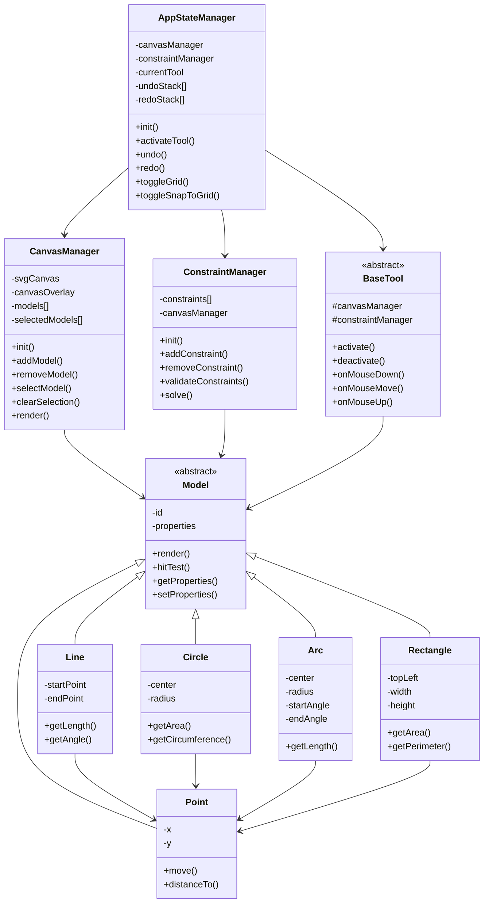
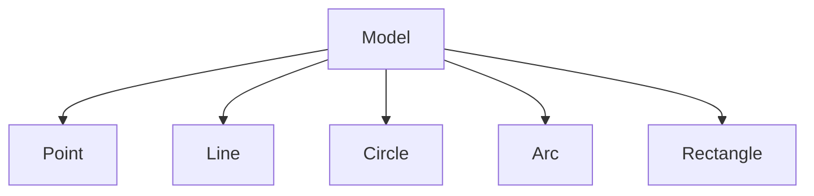
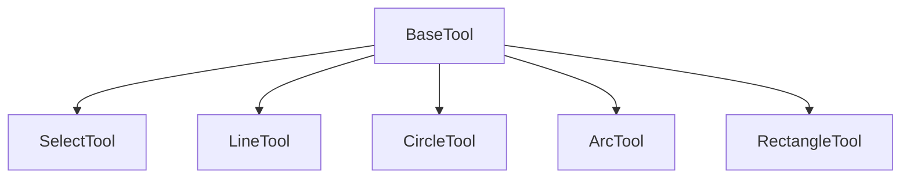

# Class Diagram

The following class diagram shows the relationships between the major components of the CAD Editor:

## Class Relationships

### AppStateManager
- Central manager for application state
- Maintains undo/redo history
- Manages tool activation and grid settings
- Coordinates between CanvasManager and ConstraintManager

### CanvasManager
- Handles rendering and model management
- Manages selection state
- Coordinates with SVG canvas and overlay
- Provides model manipulation methods

### ConstraintManager
- Manages geometric constraints between models
- Validates constraint satisfaction
- Solves constraint systems
- Updates model positions based on constraints

### Models
All model classes inherit from the abstract Model class and implement:
- Rendering logic
- Hit testing
- Property management
- Geometric calculations

### Tools
All tools inherit from BaseTool and implement:
- Mouse event handling
- Model creation/modification logic
- Constraint creation
- Visual feedback

## Inheritance Hierarchies

### Models

### Tools
