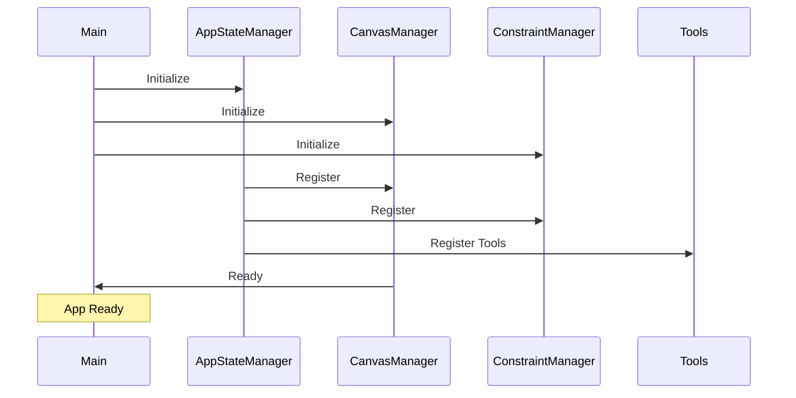
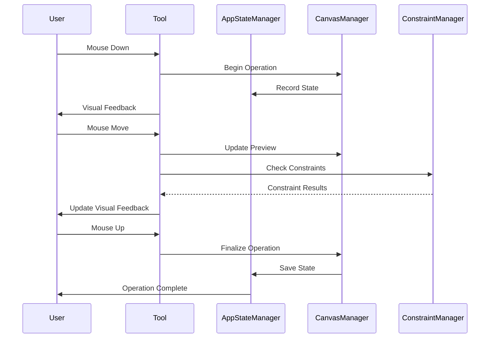
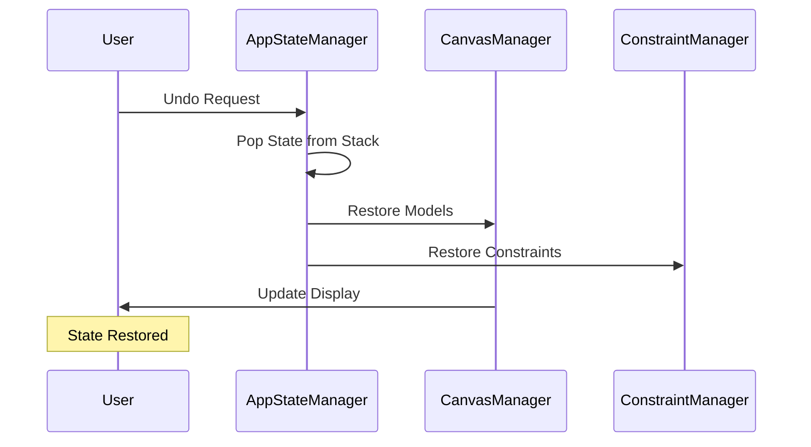
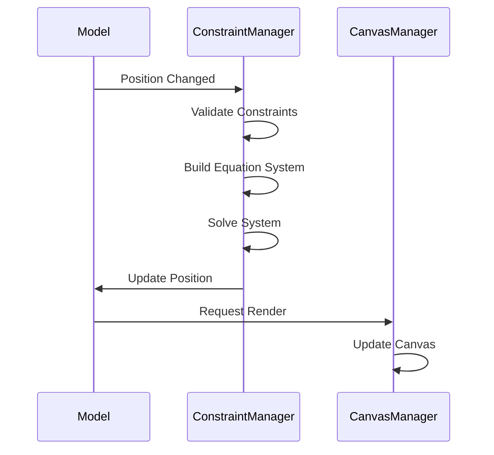
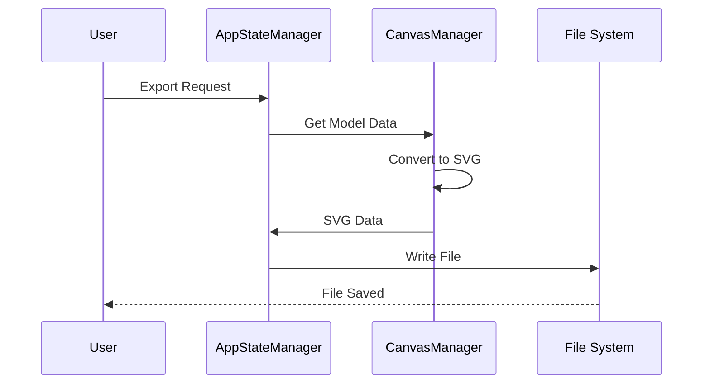
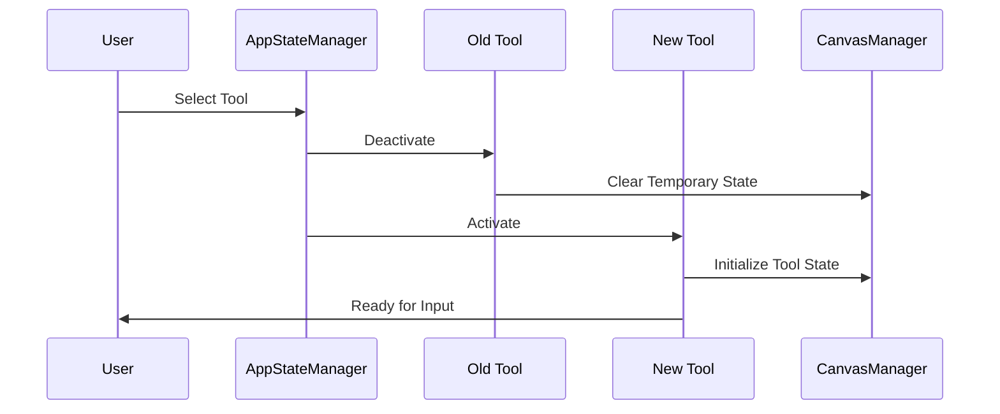

# Flow Diagrams

This document outlines the key processes and workflows in the CAD Editor application.

## Application Initialization Flow

## Drawing Operation Flow

## Undo/Redo Flow

## Constraint Resolution Flow

## Save/Export Flow

## Tool Activation Flow

These flow diagrams illustrate the main processes in the CAD Editor application. Each diagram shows the interaction between different components and the sequence of operations that occur during various user actions. 