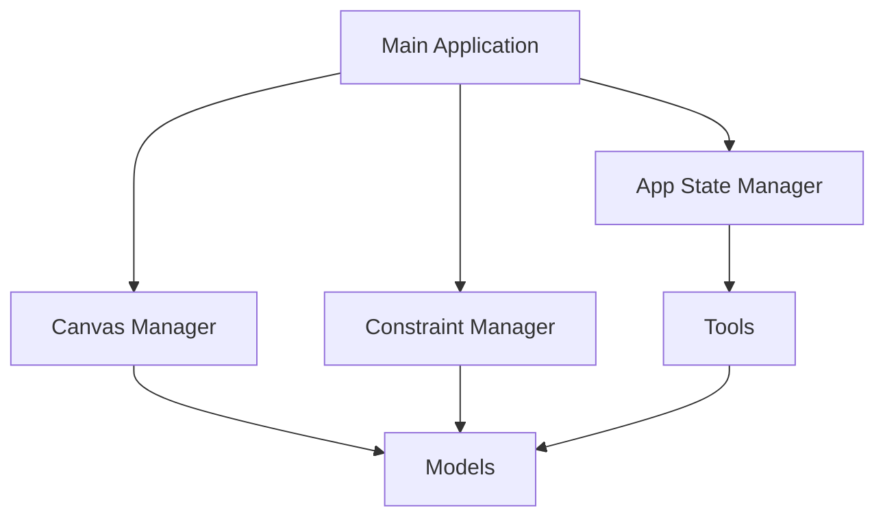

# CAD Editor Documentation

Welcome to the CAD Editor documentation. This application is a web-based Computer-Aided Design (CAD) editor that allows users to create and manipulate geometric shapes with precision and ease.

## Overview

The CAD Editor is built using modern web technologies and provides a robust set of tools for creating and editing geometric designs. The application features:

- Interactive SVG-based canvas
- Precise geometric tools (lines, circles, arcs, rectangles)
- Grid system with snap functionality
- Constraint management
- Undo/redo capability
- Auto-save functionality
- Debug mode for development
- Export to SVG capability

## Core Components

The application is structured into several key components:

### Models
Geometric primitives that form the basis of all drawings:
- Points
- Lines
- Circles
- Arcs
- Rectangles

### Tools
Interactive tools for creating and manipulating geometric objects:
- Select Tool
- Line Tool
- Circle Tool
- Arc Tool
- Rectangle Tool

### Managers
Core systems that handle application state and functionality:
- App State Manager
- Canvas Manager
- Constraint Manager

### Utilities
Helper functions and UI components:
- Math Utilities
- Logger
- Properties Panel
- Dimension Input

## Getting Started

To begin using the CAD Editor:

1. The main canvas is your workspace where all drawing happens
2. Use the toolbar to select different drawing tools
3. The properties panel on the right allows you to modify object properties
4. Grid and snap settings can be adjusted in the toolbar
5. Use keyboard shortcuts (documented in each tool's page) for efficient workflow

## Technical Architecture

The application follows a modular architecture with clear separation of concerns:

For more detailed information about the architecture and individual components, please navigate through the documentation using the sidebar. 